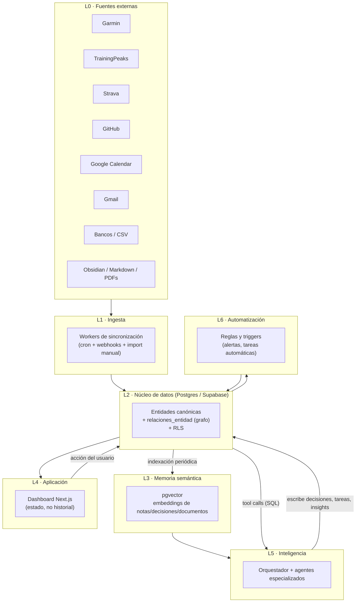
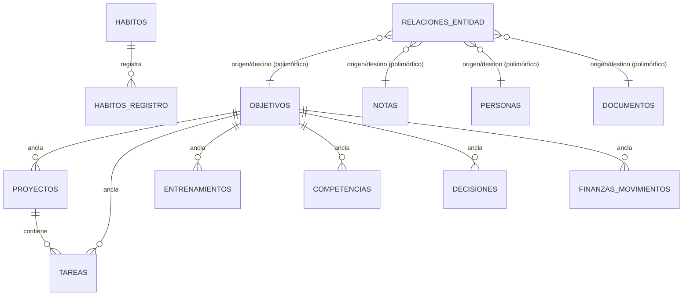

# Antonia OS — Arquitectura del Sistema Operativo Personal

> Documento de diseño estratégico. No es una especificación de implementación línea a línea: es el marco de decisiones que debe sobrevivir 10 años de cambios de stack, de integraciones y de agentes.
>
> Este documento parte de lo que **ya existe** en el proyecto (Fase 1 ya implementada: esquema de datos, autenticación y RLS reales en Supabase, Home con 6 bloques de estado) y proyecta desde ahí, en vez de rediseñar desde cero.

---

## 0. Cómo leer este documento

Está organizado en las 10 preguntas que planteaste, en tu mismo orden (incluyendo el salto de numeración del punto 6, que se respeta tal cual). Cada sección tiene: qué propongo, por qué, y dónde desafío tu planteamiento original.

---

## 1. Filosofía del sistema

### 1.1 El problema real que estás resolviendo

No es "centralizar información". Eso es el síntoma. El problema real es que **hoy tu contexto vive fragmentado entre sistemas que no se hablan**, lo que te obliga a ti a ser el "pegamento" — tú cargas en tu cabeza la relación entre "mi TSB bajó" y "esta semana gasté más de lo normal" y "llevo 3 días sin dormir bien" y "tengo una decisión de trabajo pendiente". Antonia OS no es un lugar donde *guardar* datos: es el sistema que **reemplaza tu trabajo de correlacionar** información que vive en silos.

Esto importa porque cambia el criterio de éxito: el sistema no gana puntos por tener muchas integraciones o muchos gráficos. Gana puntos cuando, al abrirlo, ves algo que no habrías conectado tú sola a tiempo.

### 1.2 Principios de diseño

1. **Una sola fuente de verdad, muchas superficies de lectura.** Postgres (Supabase) es el sistema de registro. Garmin, Strava, TrainingPeaks, Obsidian, Google Calendar son *fuentes* o *superficies de escritura*, nunca el lugar donde vive el dato canónico. Si el día de mañana Strava desaparece, tu historial no debería perderse porque ya fue sincronizado hacia tu propia base.
2. **Datos > Dashboard > Agentes, en ese orden de inversión.** Un agente brillante sobre datos incompletos produce confianza falsa, que es peor que no tener el dato. El orden correcto de madurez es: modelo de datos sólido → tú alimentándolo consistentemente → panel que refleja ese estado → reglas determinísticas sobre esos datos → recién ahí, IA.
3. **Todo es una entidad, y toda entidad puede relacionarse con cualquier otra.** Ya lo intuiste al pedir un modelo de datos relacional, y ya está construido: la tabla `relaciones_entidad` es un grafo genérico (`origen_tipo/origen_id` → `destino_tipo/destino_id`). Esto es la diferencia entre un CRM con 40 tablas rígidas y un sistema donde una decisión puede conectarse a un objetivo, un proyecto, una persona y una nota, sin haber anticipado esa combinación de antemano.
4. **Dominio ≠ tipo de entidad.** Este es un error común en sistemas PKM: mezclar "en qué área de mi vida está esto" con "qué tipo de cosa es esto". Tu esquema ya lo hace bien: `dominio` es una etiqueta transversal (`entrenamiento`, `salud`, `finanzas`, `trabajo`, `proyectos`, `vida_personal`) que cuelga de `tareas`, `proyectos`, `notas`, `habitos`, `documentos` — mientras que el *tipo* de entidad (tarea, nota, hábito) define su forma y comportamiento. No crees una tabla nueva por cada combinación dominio×tipo.
5. **Ontología mínima viable: especializa solo cuando el dominio lo exige.** Entrenamientos, competencias, finanzas y métricas fisiológicas merecen tablas propias porque tienen estructura propia (TSS, distancia, categoría, tipo de movimiento). "Lecturas", "reflexiones", "viajes" **no** necesitan tabla propia — son `notas` con un `tipo`. La tentación en año 2 de un PKM es crear una tabla por cada sustantivo nuevo que aparece; resístela. Regla práctica: *nueva tabla solo si necesitas columnas tipadas y consultas específicas sobre ese tipo de dato; si no, es una nota o un documento etiquetado.*
6. **Las decisiones son datos de primera clase, con seguimiento de resultado.** Ya está en tu esquema (`decisiones.resultado_esperado`, `resultado_real`, `aprendizaje`). Esto es, sin que lo hayas llamado así, el embrión de un *loop de calibración*: en la Fase 5-6 esta tabla es lo que le permite a un agente aprender de qué tan buenas fueron tus decisiones pasadas, no solo qué pasó.
7. **Diseña para que la IA futura no rompa el esquema de hoy.** No necesitas construir RAG ahora, pero si hoy metes toda la info en campos de texto libre sin estructura mínima (fecha, dominio, tipo, relación a objetivo), en la Fase 5 vas a tener que reprocesar todo. El criterio no es "¿lo necesito ahora?" sino "¿esta decisión de esquema me bloquea después?".
8. **Ownership real y sin vendor lock-in.** Todo exportable, todo en un Postgres que controlas (Supabase es reemplazable, no el dueño de tus datos). Es coherente con tu objetivo de "vida sostenible basada en sistemas", que implica que el sistema no dependa de que una startup de terceros siga viva.

### 1.3 Por qué "Jarvis" es la metáfora que te va a desviar

Vale la pena desafiar esto directamente porque va a influir cómo diseñas la Fase 5-7.

"Jarvis" implica un cerebro único y omnisciente que todo lo sabe y todo lo decide. Eso es exactamente el patrón que falla en producción: un solo prompt gigante con "todo tu contexto" es caro, lento, difícil de depurar cuando se equivoca, y no escala — cada dominio nuevo que agregas hace el contexto más ruidoso para los demás dominios.

La metáfora que sí escala es la de un **sistema nervioso**: un tronco de datos compartido (Postgres + memoria semántica), varios "especialistas" con contexto acotado a su dominio (Coach, CFO, Nutricionista), y un **orquestador delgado** que rutea y sintetiza, no que sabe todo. Es literalmente el patrón que ya estás usando en esta sesión (agente principal + subagentes especializados) — no es casualidad, es el patrón que funciona cuando el problema es grande y heterogéneo.

Conclusión práctica: no diseñes "un" asistente. Diseña **el sustrato de datos y memoria compartido**, y encima de eso, agentes pequeños y reemplazables. "Jarvis" es la experiencia percibida en la superficie (una sola conversación, un solo lugar), no la arquitectura interna.

### 1.4 Cómo evitar que colapse en 10 años

Los sistemas personales mueren por tres razones, en este orden de frecuencia:

- **Fricción de captura.** Si registrar un dato toma más de 10 segundos o requiere abrir una app distinta, dejas de hacerlo en semana 3. Mitigación: la integración automática (Garmin/Strava/GitHub) existe precisamente para que el 80% del dato deportivo y de proyectos nunca requiera tipeo manual. Lo manual (finanzas, decisiones, journal) debe tener el path más corto posible.
- **Explosión de esquema.** Cada "necesito un campo más" sin disciplina termina en 40 tablas con lógica duplicada. Mitigación: el principio 5 (ontología mínima) y una revisión de esquema cada vez que agregas una tabla — pregúntate si es de verdad una entidad nueva o una nota tipada.
- **Divergencia entre lo que el sistema dice y lo que es verdad.** Si las integraciones se rompen silenciosamente (un token OAuth expira, un webhook deja de llegar) y nadie se entera, el sistema se vuelve mentiroso y dejas de confiar en él, lo cual es terminal. Mitigación: cada fuente de sincronización necesita un estado visible ("Strava: última sync hace 6 días ⚠") — esto es un widget de salud del sistema, no un dato de tu vida, y debería vivir en el dashboard desde el día en que exista la primera integración.

---

## 2. Arquitectura general

### 2.1 Capas del sistema

### 2.2 Flujo de información

1. Un dato entra por **L1** (una sincronización de Strava, una carga manual de gasto, un archivo Markdown exportado de Obsidian).
2. Se normaliza y aterriza en su tabla canónica en **L2**, etiquetado por `fuente` y, cuando corresponde, vinculado a otras entidades vía `relaciones_entidad`.
3. **L4** (el dashboard) lee directamente de L2 — sin capas intermedias — porque el dashboard necesita el dato más fresco posible y consultas simples.
4. Periódicamente (batch nocturno, no en tiempo real), el contenido no estructurado relevante (notas, decisiones, documentos) se **re-indexa** en **L3** como embeddings.
5. Cuando existan agentes (**L5**), estos consultan L2 directamente por hechos exactos (vía SQL/tool-calling: "¿cuál es mi TSB de hoy?") y L3 por contexto cualitativo ("¿qué aprendí la última vez que bajé el volumen antes de una carrera?"). Nunca al revés: los números exactos no deben depender de una búsqueda semántica que puede alucinar.
6. Lo que un agente concluye (una recomendación, una tarea sugerida) se **escribe de vuelta en L2** como una fila real (una `tarea`, una `decision` en borrador) — no se queda solo en una respuesta de chat que se pierde. Esto es lo que evita que "la IA opine" sin que el sistema aprenda nada.
7. **L6** son reglas simples ("si TSB < -20, crear alerta") que corren sobre L2 sin necesidad de un LLM — deben existir *antes* que los agentes, porque son más baratas, más depurables y generan confianza en el concepto de "alerta automática" antes de delegárselo a un modelo.

### 2.3 Estado actual vs. visión completa

Ya construido (Fase 1): L2 casi completo (14 tablas, RLS activo, autenticación), y un L4 mínimo pero bien enfocado (Home con estado del día, no gráficos). Lo que falta para cerrar el círculo de la visión: L1 (hoy todo es manual), L3, L5 y L6 completos. Esto confirma que el orden de fases que propongo en la sección 10 es continuación natural de lo ya construido, no un giro de rumbo.

---

## 3. Dominios

### 3.1 Los dominios que ya existen en el esquema

Tu constraint actual (`CHECK dominio = ANY (...)`) define exactamente 6 valores: `entrenamiento`, `salud`, `finanzas`, `trabajo`, `proyectos`, `vida_personal`.

Nota algo importante: **"dominio" en tu esquema es una etiqueta de las entidades transversales** (tareas, proyectos, notas, hábitos, documentos, objetivos) — no existe una tabla "Dominio". Esto es correcto y hay que preservarlo: los dominios son una taxonomía plana, no entidades con las que se relacionan cosas.

### 3.2 Evaluación crítica de los 6 dominios

Comparando con las 7 áreas de tu contexto original (Deporte, Salud, Finanzas, Trabajo, Proyectos personales, Desarrollo personal, Vida personal), hay una que se perdió en el mapeo: **Desarrollo personal**. Hoy una reflexión de journal o un curso terminado cae en `vida_personal` (o en `dominio = NULL` dentro de `notas`), donde se va a mezclar con "viajes" y "compras" — dominios con energía completamente distinta.

**Propuesta:** agregar un 7º valor, `desarrollo_personal`, al constraint. Es barato (una migración de un ALTER TABLE), y evita que en año 2 tengas que reclasificar cientos de notas.

Sobre las que **no** deberían ser dominios, aunque el usuario las mencionó como "categorías":
- **Objetivos** no es un dominio, es un atributo (`objetivos.dominio` ya apunta a uno de los 6-7). Un objetivo *vive dentro* de un dominio, no es un dominio en sí. Correcto como está.
- **Conocimiento** no es un dominio de vida, es una **capa transversal** (la tabla `notas` + `documentos`, potencialmente con `dominio = NULL` cuando el conocimiento no pertenece a un área específica, ej. una idea de negocio nueva sin encasillar). No lo forzaría dentro de los 6-7.
- **Relaciones** tampoco es un dominio: es un **tipo de entidad** (`personas`) que se conecta transversalmente a cualquier dominio vía `relaciones_entidad` (tu entrenador se relaciona con `entrenamiento`, tu familia con `vida_personal`, un colega con `trabajo`). Convertirla en dominio forzaría a decidir arbitrariamente "¿mi pareja es vida_personal o trabajo?" cuando la respuesta correcta es "depende del contexto de cada nota o evento donde aparece".

**Dominios finales recomendados (7):** `entrenamiento`, `salud`, `finanzas`, `trabajo`, `proyectos`, `desarrollo_personal`, `vida_personal`.

---

## 4. Modelo de datos

### 4.1 Entidades principales (ya construidas + lo que falta)

| Entidad | Rol | Estado |
|---|---|---|
| `objetivos` | Hub central: todo objetivo tiene un dominio y fecha, y es el ancla de proyectos/tareas/decisiones/entrenamientos/competencias/finanzas | ✅ construida |
| `proyectos` | Iniciativas con estado (idea→activo→completado), opcionalmente ligadas a un objetivo y con `repo_url` para GitHub | ✅ construida |
| `tareas` | Unidad accionable, ligada a proyecto y/o objetivo | ✅ construida |
| `entrenamientos` | Sesión de entreno con métricas de rendimiento y `fuente` (manual/TP/Garmin/Strava) | ✅ construida |
| `competencias` | Carreras, con resultado y flag `clasifico` (clave para tu objetivo de clasificación a Mundial) | ✅ construida |
| `metricas` | Serie temporal genérica (`tipo`/`valor`/`unidad`/`fecha`) — cubre TSB, HRV, peso, sueño sin una tabla por métrica | ✅ construida |
| `decisiones` | Decisión con contexto, opciones, resultado esperado/real y aprendizaje | ✅ construida |
| `notas` | Contenido no estructurado tipado (nota/journal/lectura/curso/reflexion/aprendizaje) | ✅ construida |
| `finanzas_movimientos` | Ingreso/gasto/ahorro/inversión | ✅ construida |
| `habitos` + `habitos_registro` | Definición de hábito + registro diario de cumplimiento | ✅ construida |
| `documentos` | Referencia a archivo en Storage (examen, contrato, certificado, plan) | ✅ construida |
| `personas` | Relaciones humanas (familia, pareja, entrenador, equipo, colega) | ✅ construida |
| `relaciones_entidad` | Grafo genérico origen↔destino entre cualquier par de entidades | ✅ construida — pieza clave |
| `eventos` (calendario) | Eventos con fecha inicio/fin, para sync con Google Calendar | ⛔ falta — necesaria en Fase 3 |
| `memoria_embeddings` | Chunks vectorizados de notas/decisiones/documentos para RAG | ⛔ falta — necesaria en Fase 5 |
| `agent_actions` | Bitácora de qué hizo cada agente, cuándo y con qué resultado | ⛔ falta — necesaria en Fase 6 |

### 4.2 Diagrama entidad-relación (núcleo actual)

*(El diagrama simplifica: `relaciones_entidad` en realidad conecta cualquiera de las 11 entidades tipadas entre sí, no solo las 4 mostradas — es intencionalmente polimórfica.)*

### 4.3 Patrones ya presentes que hay que preservar y replicar

- **Métrica genérica en vez de tabla por métrica.** Cuando llegue una fuente nueva de datos fisiológicos (ej. glucosa, VO2max), va en `metricas` con un `tipo` nuevo, no en una tabla nueva.
- **Definición + registro** (`habitos`/`habitos_registro`). Este patrón (entidad de configuración + entidad de eventos diarios) es el que hay que replicar para cualquier cosa "recurrente" futura — por ejemplo, si más adelante quieres trackear rutinas de movilidad o suplementación diaria, es el mismo patrón, no una tabla nueva por hábito.
- **Grafo polimórfico** (`relaciones_entidad`). Es la pieza que hace que "todo se conecte" sin explosión de foreign keys. Cuando agregues `eventos` o `memoria_embeddings`, deben poder aparecer como `origen_tipo`/`destino_tipo` en este grafo sin tocar su esquema.

### 4.4 Brechas concretas a cerrar antes de integrar (Fase 3) y antes de RAG (Fase 5)

1. **Idempotencia de sincronización.** Hoy `entrenamientos.fuente` existe, pero no hay un `fuente_id` (el ID externo de Garmin/Strava/TrainingPeaks) con constraint único `(fuente, fuente_id)`. Sin esto, cada re-sincronización duplicará entrenamientos. Es la primera migración a hacer antes de construir cualquier integrador real.
2. **Tabla `memoria_embeddings`** separada de las tablas de contenido (no meter una columna `vector` directo en `notas`), con `(entidad_tipo, entidad_id, chunk_index, chunk_text, embedding)`. Separarla permite reindexar sin tocar el contenido original y tener varios chunks por nota larga.
3. **Tabla `eventos`** para calendario (fecha_inicio, fecha_fin, tipo, fuente, relacionable vía `relaciones_entidad`), necesaria antes de integrar Google Calendar.
4. **Tabla `agent_actions`** (qué agente, qué acción, qué leyó, qué escribió, timestamp) — necesaria antes de dar a cualquier agente permiso de escritura autónoma en Fase 6-7, para poder auditar y revertir.

---

## 5. Dashboard

### 5.1 Lo que ya construiste está bien orientado — con una corrección de secuencia

Tu Home actual (readiness/TSB, objetivo activo, próxima tarea, último entrenamiento, próxima competencia, alertas, última decisión sin resolver) ya sigue el principio correcto: **estado y acción, no historial ni gráficos**. No lo cambiaría de raíz. Sí reordenaría la jerarquía visual.

### 5.2 Estructura recomendada (3 niveles, de arriba hacia abajo)

1. **Nivel de acción (lo primero que ves):** alertas activas + decisiones sin resolver + próxima tarea vencida o urgente. Esto responde "¿qué requiere que yo haga algo hoy?".
2. **Nivel de estado (segundo bloque):** readiness/TSB de hoy, objetivo activo más próximo y sus días restantes, próxima competencia. Responde "¿dónde estoy parada?".
3. **Nivel de tendencia (solo si hay pregunta que responder, máximo 2-3 widgets, nunca por defecto todos los dominios):** carga de entrenamiento últimos 7 días, flujo de caja del mes, racha de hábitos. Esto es lo único remotamente parecido a un "gráfico", y debe limitarse a lo que cambia una decisión de la semana, no a "todo lo que se puede graficar".

Hoy tu Home mezcla los niveles 1 y 2 en el mismo orden secuencial. Sugiero mover "Alertas" y "Última decisión sin resolver" al tope, arriba de "Estado de readiness".

### 5.3 Qué no poner nunca en el Home

- Gráficos históricos de más de 90 días (eso pertenece a una vista de "Revisión" separada, no al Home).
- Cualquier métrica que no cambie una decisión esta semana (ej. "peso hace 6 meses").
- Más de un widget de tendencia por dominio — si notas que quieres agregar un segundo gráfico de entrenamiento, es señal de que necesitas una página `/entrenamiento` dedicada, no un Home más ancho.

La prueba de fuego para cualquier widget nuevo: *si lo elimino, ¿dejo de saber algo que me haría actuar distinto hoy?* Si la respuesta es no, no va en el Home.

---

## 7. Integraciones

### 7.1 Principio de integración

Todas las fuentes externas convergen en las mismas tablas canónicas de L2, diferenciadas por el campo `fuente`. El método de ingesta (API en vivo, webhook, batch programado, import manual) es un detalle de implementación de L1 — nunca debe filtrarse al modelo de datos ni al dashboard, que siempre leen de la misma tabla sin que importe de dónde vino el dato.

Regla de elección de método:
- **API + webhook en tiempo real** cuando la fuente tiene una API pública decente y estable.
- **Batch programado (cron diario/horario)** cuando la API existe pero es inestable, no soporta webhooks, o requiere aprobación de partner.
- **Import manual asistido (CSV / carpeta sincronizada)** cuando no hay API viable — y aun así, debe aterrizar en la misma tabla con `fuente = 'manual'` o el nombre de la fuente real, nunca en un formato paralelo.

### 7.2 Matriz de integración

| Fuente | Método recomendado | Prioridad | Nota |
|---|---|---|---|
| **Strava** | API OAuth + webhooks (tiene API pública robusta y gratuita) | Alta — primera integración | Mejor punto de entrada: rápida, bien documentada, cubre swim/bike/run |
| **GitHub** | API + webhooks (issues/commits → `tareas`/`proyectos`) | Alta — segunda integración | Ya tienes `proyectos.repo_url`; un webhook de "issue cerrado" puede completar una `tarea` automáticamente |
| **Google Calendar** | API OAuth, sync batch cada pocas horas (dos vías: leer eventos, opcionalmente escribir bloques de tapering pre-competencia) | Alta | Requiere la tabla `eventos` (sección 4.4) |
| **Garmin** | Sin API pública oficial abierta para desarrolladores individuales; batch diario vía export/API no oficial, o indirectamente vía Strava/TrainingPeaks si ya sincronizas ahí | Media — evaluar si Strava ya cubre el 80% del dato antes de invertir aquí | No bloquear el roadmap por esto; es la integración más frágil técnicamente |
| **TrainingPeaks** | API oficial existe pero requiere aprobación como partner; mientras tanto, export manual de workouts | Media/Baja | Revisar necesidad real si Strava + Garmin ya cubren las métricas clave (TSS, IF ya están en tu esquema) |
| **Gmail** | API OAuth, alcance acotado a labels específicos (confirmaciones de carrera, comprobantes) — no leer la bandeja completa | Baja | Riesgo de privacidad/complejidad alto para el valor que aporta; dejar para el final |
| **Finanzas (bancos)** | Sin APIs abiertas confiables en Chile en general → import manual de CSV/cartola primero; evaluar agregador tipo Belvo más adelante | Media | Empezar simple: carga manual mensual, es sostenible a este volumen |
| **Archivos / PDFs** | Import manual a Supabase Storage + fila en `documentos`, con OCR/extracción de texto opcional para alimentar `memoria_embeddings` en Fase 5 | Media | |
| **Markdown / Obsidian** | Script de sync (uni o bidireccional) que trata tu vault como superficie de escritura y Postgres como registro canónico — no una API en vivo, un sync de carpeta | Media | Obsidian sigue siendo donde escribes cómodamente; el sistema absorbe ese contenido, no reemplaza la experiencia de escritura |

---

## 8. IA y memoria (RAG real, no un chatbot)

### 8.1 Los cuatro tipos de memoria que el sistema necesita

1. **Memoria estructurada** = las tablas de Postgres (hechos exactos: "TSB de hoy es -12"). Ya existe.
2. **Memoria semántica** = embeddings sobre texto no estructurado (`notas`, `decisiones.contexto/razon/aprendizaje`, texto extraído de `documentos`), en una tabla `memoria_embeddings` con pgvector, indexada por chunks con metadata (`dominio`, `tipo`, `fecha`, `entidad_id`).
3. **Memoria episódica/de decisión** = la tabla `decisiones` misma. Es distinta de la memoria semántica genérica porque tiene estructura de "elección → resultado → aprendizaje", que es literalmente un log de calibración: permite que un agente futuro pondere "la última vez que hice X en esta situación, resultó Y".
4. **Memoria de trabajo** = el contexto de una sesión de agente puntual (la conversación actual). No se persiste globalmente; vive y muere con la sesión, salvo que algo de ahí se promueva explícitamente a una `decision` o `nota`.

### 8.2 Por qué RAG "puro" (todo a vectores) es el error común

El error típico en sistemas PKM-con-IA es tratar todo como texto a embeber y buscar por similitud, incluidos los números. Esto produce agentes que "alucinan aproximaciones" de datos que en realidad existen exactos en una tabla. La arquitectura correcta es **híbrida**:

- Preguntas de **hecho exacto** ("¿cuál fue mi TSS de la semana pasada?", "¿cuánto llevo ahorrado este mes?") → **tool-calling a SQL** sobre L2, nunca vector search.
- Preguntas de **contexto cualitativo** ("¿qué aprendí la última vez que me lesioné entrenando fuerte antes de una carrera?", "¿qué dije sobre esta decisión de trabajo hace 3 meses?") → **búsqueda vectorial** sobre L3.
- La mayoría de las preguntas reales combinan ambas: un agente Coach necesita el dato exacto de carga de esta semana (SQL) *y* el patrón cualitativo de cómo respondiste a cargas similares en el pasado (vector).

### 8.3 El "context assembler"

En vez de que cada agente arme su propio contexto ad-hoc, conviene un servicio intermedio (parte de L3/L5) cuya única responsabilidad es: dada una pregunta o un disparador, ensamblar (a) un snapshot estructurado relevante (objetivos activos, carga de entrenamiento reciente, estado financiero, próxima competencia), (b) los top-k fragmentos semánticamente relevantes de notas/decisiones, y (c) el historial de conversación reciente — y entregar eso como contexto a cualquier agente que lo pida. Esto evita reimplementar la lógica de recuperación en cada agente y es el componente que de verdad merece el nombre "memoria de Antonia", más que cualquier agente individual.

---

## 9. Agentes especializados (segunda etapa)

### 9.1 Por qué no un agente único

Ya lo argumenté en 1.3: un agente monolítico con "todo el contexto" es caro, lento y frágil. Además, cada dominio tiene una función objetivo distinta (el Coach optimiza rendimiento/salud a largo plazo, el CFO optimiza runway/ahorro, el Gestor de Proyectos optimiza throughput) — mezclarlos en un solo prompt genera respuestas mediocres en los tres frentes a la vez.

### 9.2 Agentes propuestos y sus fronteras

| Agente | Lee de | Escribe en | Frontera clara |
|---|---|---|---|
| **Coach Deportivo** | `entrenamientos`, `metricas`, `competencias`, `objetivos` (dominio entrenamiento) | `tareas` (ajustes de plan), `decisiones` (draft) | No opina de finanzas ni de trabajo |
| **Nutricionista** | `metricas` (peso, sueño), `notas` (dominio salud), `habitos` | `tareas`, `notas` | Se coordina con Coach vía datos compartidos, no vía conversación directa |
| **Analista de Rendimiento** | Todo lo de Coach + Nutricionista + `decisiones` | `notas` tipo `aprendizaje`, síntesis semanal | Es el único que cruza entrenamiento+salud; no toca finanzas/trabajo |
| **CFO Personal** | `finanzas_movimientos`, `objetivos` (dominio finanzas) | `tareas`, `decisiones` (draft) | Dominio cerrado, no necesita saber de entrenamiento |
| **CEO de NextRace / Gestor de Proyectos** | `proyectos`, `tareas` (dominio proyectos/trabajo), GitHub vía L2 | `tareas`, `proyectos` (estado) | Uno por cada iniciativa relevante, o uno genérico parametrizado por `proyecto_id` |
| **Asistente de vida / Orquestador** | Snapshot completo vía *context assembler* | `decisiones` (enruta a agente correcto), síntesis final al usuario | Es el único punto de entrada conversacional; no hace el trabajo de dominio él mismo |

### 9.3 Cómo se comunican entre ellos: pizarra compartida, no enjambre

No conviene que los agentes conversen libremente entre sí (impredecible, caro, difícil de depurar). El patrón correcto es **blackboard**: los agentes se comunican **a través de L2** — el Coach escribe una fila en `tareas` o una `decision` en borrador; el Analista de Rendimiento la lee después, no en tiempo real conversacional. Esto es más lento pero muchísimo más auditable, y coincide con el principio 6 de la filosofía (la IA escribe datos reales, no solo respuestas efímeras).

### 9.4 ¿Conviene un agente principal que coordine a todos?

Sí — pero como **router delgado**, no como cerebro que sabe todo. Su trabajo es: recibir tu pregunta o disparador, decidir qué especialista(s) invocar (posiblemente ninguno, si es una pregunta de hecho simple que resuelve él mismo con SQL), y sintetizar la respuesta final. Es exactamente el rol que cumple el agente principal de esta misma sesión frente a sus subagentes — el patrón ya validado, replicado a tu dominio personal.

---

## 10. Roadmap

### 10.1 Fases

**Fase 1 — Sistema centralizado (✅ hecha).** Esquema de datos completo, autenticación, RLS real, Home mínimo de estado. Ya construido.

**Fase 2 — Uso real disciplinado (siguiente, antes que cualquier integración).** CRUD completo para cargar datos manualmente y usar el sistema a diario durante unas semanas. Objetivo: que la fricción de captura y los huecos del modelo de datos se noten *contigo* usándolo, antes de automatizar la entrada de datos incorrectos. Integrar demasiado pronto sobre un modelo que aún no se ha estresado con uso real es el error más común en estos proyectos.

**Fase 3 — Integraciones de alto valor / bajo esfuerzo primero.** Strava → GitHub → Google Calendar (en ese orden, por calidad de API). Antes de esto: cerrar la brecha de idempotencia (`fuente_id` único, sección 4.4) y crear la tabla `eventos`.

**Fase 4 — Dashboard inteligente basado en reglas, sin IA todavía.** Motor de alertas determinísticas (TSB bajo umbral, gasto sobre presupuesto, racha de hábito rota, tarea vencida). Deliberadamente antes de los agentes: construye confianza en el concepto de "el sistema me avisa cosas" con lógica que puedes auditar en una línea de código, antes de delegárselo a un modelo.

**Fase 5 — Memoria semántica / RAG.** Tabla `memoria_embeddings`, pipeline de indexación batch, *context assembler* híbrido (SQL + vector). Se construye el "bibliotecario" antes que los "lectores" (agentes) — un agente sin memoria semántica rica solo repetirá lo que ya ves en el dashboard.

**Fase 6 — Primer agente especializado: Coach Deportivo.** Se elige empezar por deporte porque es el dominio con más datos ricos y estructurados ya cargados (entrenamientos, métricas, competencias), lo que da la señal más fuerte para validar el patrón de tool-calling + memoria antes de replicarlo a los demás agentes.

**Fase 7 — Orquestador + agentes restantes + automatizaciones con aprobación humana.** Nutricionista, CFO, Analista de Rendimiento, Gestor de Proyectos, Asistente de vida como router. Cualquier escritura autónoma de un agente pasa por un gate de aprobación tuya al principio (tabla `agent_actions` para auditar), y se relaja gradualmente a medida que confías en cada agente específico.

**Fase 8 — Sistema operativo completo.** Automatizaciones proactivas sin aprobación manual en los casos de bajo riesgo ya validados, sincronización robusta de Garmin/TrainingPeaks, posible interfaz de voz/móvil. Esta fase no tiene fecha objetivo realista hoy — es la dirección, no el siguiente sprint.

### 10.2 Qué construir primero, y por qué

Lo primero es **Fase 2**, no una integración ni el dashboard "inteligente". La tentación natural es saltar a conectar Garmin porque es la parte más visible y emocionante, pero el valor real del sistema depende de que el modelo de datos aguante el uso diario real — y eso solo se descubre usándolo, no diseñándolo más. Cada fase de este roadmap depende de que la anterior haya sido *usada*, no solo construida.
